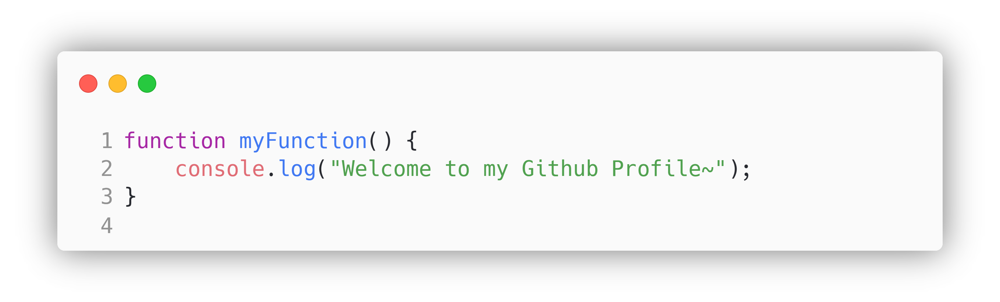

<!-- ## Hi.
I'm fine. Thank you, and you? -->

<h1 align="center">Hi there, I'm Gloria</h1>
<h3 align="center">An aspiring Software Full-Stack Developer</h3>

  

---
 
 

<!--  -->
<!--  -->
<!-- 

 -->
<!--  -->
<!--    -->

  

<!-- 
<h3 align="center">Best repositories</h3>

 -->

---

- 🔭 I’m currently working as a Software Developer in Singapore.

- 🌱 I’m currently learning Full-stack Development and Devops.
<!-- - 👯 I’m looking to collaborate on ...
- 🤔 I’m looking for help with ...-->
- 💬 I completed Master of Science in Artificial Intelligence (MSAI) at Nanyang Technological University.

<!-- - 📫 How to reach me: **frankyoung@outlook.sg** -->

- 😄 Pronouns: She/Her

---

<!-- <h3 align="center">Connect with me</h3>

    
    
    
    

 -->
<!-- 
--- -->

<h3 align="center">Languages and Tools</h3>

<!--  -->

 

<!--  -->

